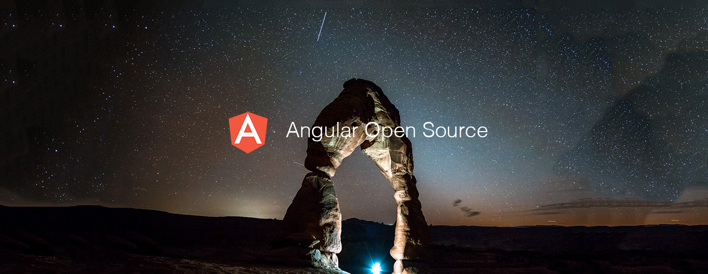

# Angular.js Top 10 Open Source Projects for the Past Month (v.Jun 2018)

</a>

For the past month, we ranked nearly 160 Angular Open Source Projects to pick the Top 10. 
We compared projects with new or major release during this period. Mybridge AI ranks projects based on a variety of factors to measure its quality for professionals.

* Average number of Github stars in this edition: 1,104 ⭐️
* Topics: Documentation, Build, State Management, UX guidelines, Electron, Example App, Video, Pre-rendering, ASP.NET, OAuth 2

Open source projects can be useful for programmers. Hope you find an interesting project that inspires you.

 

### Course of the month:

[A) Beginners: Angular (Full App) with Angular Material, Angularfire & NgRx.](http://bit.ly/2EuWavj) [1,301 recommends, 4.7/5 stars]

[B) Angular & NodeJS — The MEAN Stack Guide.](http://bit.ly/2HVnkJj) [6,009 recommends, 4.6/5 stars]

 

## Rank 1
### [Docz: It has never been so easy to document your things. (TypeScript support) [★5562]](https://github.com/pedronauck/docz?utm_source=mybridge&utm_medium=blog&utm_campaign=read_more)

 

## Rank 2
### [Ngx-build-plus: Extend the Angular CLI's default build behavior without ejecting, e. g. for Angular Elements [★55]](https://github.com/manfredsteyer/ngx-build-plus?utm_source=mybridge&utm_medium=blog&utm_campaign=read_more)

 

## Rank 3
### [Akita: Simple and Effective State Management for Angular Applications  [★178]](https://github.com/datorama/akita?utm_source=mybridge&utm_medium=blog&utm_campaign=read_more)

 

## Rank 4
### [Clarity: UX guidelines, HTML/CSS framework, and Angular components working together to craft exceptional experiences [★3693]](https://github.com/vmware/clarity?utm_source=mybridge&utm_medium=blog&utm_campaign=read_more)

 

## Rank 5
### [Angular-electron v4.0: Ultra-fast bootstrapping with Angular 6 and Electron (Typescript + SASS + Hot Reload) [★1391]](https://github.com/maximegris/angular-electron?utm_source=mybridge&utm_medium=blog&utm_campaign=read_more)

 

## Rank 6
### [Angular6-example-app v6.0: Angular 6 Example App + Angular CLI + Angular Material + Docker + Angular Example Library [★494]](https://github.com/Ismaestro/angular6-example-app?utm_source=mybridge&utm_medium=blog&utm_campaign=read_more)

 

## Rank 7
### [PeerTube: Federated (ActivityPub) video streaming platform using P2P (BitTorrent) directly in the web browser with WebTorrent and Angular. [★3127]](https://github.com/Chocobozzz/PeerTube?utm_source=mybridge&utm_medium=blog&utm_campaign=read_more)

 

## Rank 8
### [Prerender-loader: Painless universal pre-rendering for weback.   [★1509]](https://github.com/GoogleChromeLabs/prerender-loader?utm_source=mybridge&utm_medium=blog&utm_campaign=read_more)

 

## Rank 9
### [Aspnetcore-angular-universal:  Angular 6.x Universal & ASP.NET Core 2.1 Advanced Starter - PWA w/ server-side rendering for SEO, Bootstrap, i18n internationalization, TypeScript [★1137]](https://github.com/MarkPieszak/aspnetcore-angular2-universal?utm_source=mybridge&utm_medium=blog&utm_campaign=read_more)

 

## Rank 10
### [Angular-oauth2-oidc v4.0: Support for OAuth 2 and OpenId Connect (OIDC) in Angular. [★427]](https://github.com/manfredsteyer/angular-oauth2-oidc?utm_source=mybridge&utm_medium=blog&utm_campaign=read_more)

                    
